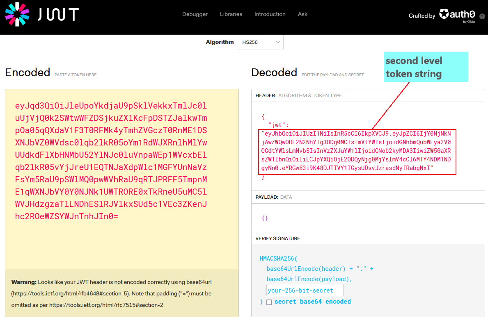
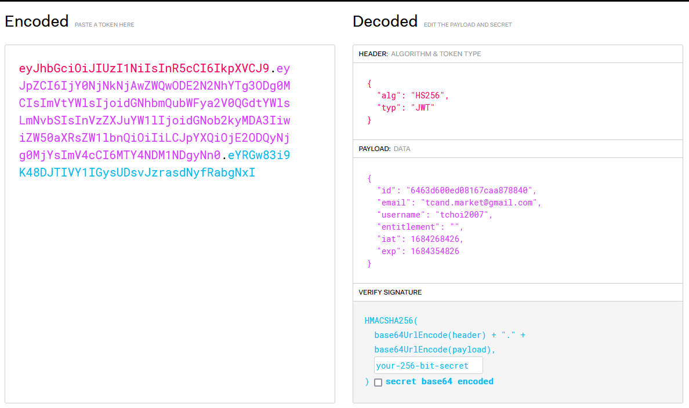
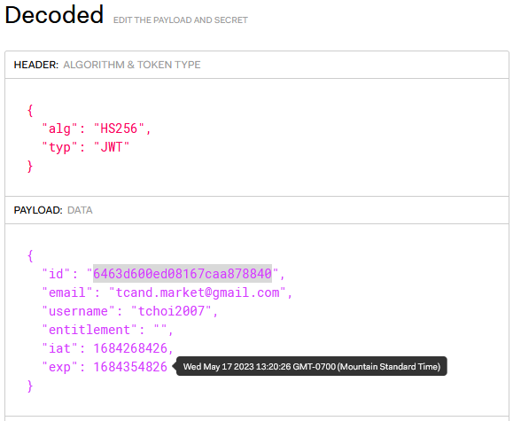

# The OH platform REST API 

## Table of Contents

- [OH platform API key features](#OH-platform-API-key-features)

- [OH User Profile Authentication Service API specification](https://documenter.getpostman.com/view/1072093/2s93eeRpNj)

- [Decode of JWT token return from User Login API](#Decode-of-JWT-token-return-from-User-Login-API)

Other Information :

#### OH platform API key features

|Features      |Item keywords        |Description|
|--------------|-----------------|----------|
|Registration|Email, username, password|The email, which has to be clicked for verification. The URL link is sent  to the  registered email. Both email and username should not be existed in OH platform previously|
|Single Sign On|jwt token|When user is logged in, an encode jwt token is generated and returned. The token is representing the user's authentication and entitlement|
|||Across regions: e.g. China, Asia, Global|
|||Across applications: e.g. OH Portal, Training Academy, and Pain Treatment module|
|Unique Application identifier|API key| An API Key that is assigned for each application to access OH  API|
|Entitlement Control| entitlement list|Different entitlements/levels can be defined by using admiration tool in which should support  the assignment of entitlement  to an user group.  E.g.  Once a user is switched from ‘staff’ group to ‘practitioner’ group, the user  has all the entitlements in ‘practitioner’ group right the way.|
|Password management|Recover Request| This API can be used to reset or change password|

#### Decode of JWT token return from User Login API

The User Login API returns the token inside Cookies under the name "express:sess". The token is automatically attached as a session cookie to OH platform's web site. If you decode the token in https://jwt.io as below:

The decoded token provides a key pair with "jwt" and value is another JWT token. The second level token string can be feed into the decoder again and a user authentication record is resulted as below.

The final decoded JWT token:
* id : the long string id is used to update the user profile
* email: the registered user email which will be referenced for User Login and Recover Request.
* username: the registered user name is used to get user's profile
* entitlement: the application should screen this entitlement to control the user's access right and usage.
* lst: timestamp for the valid session time, i.e. the login time
* exp: the expired timestamp for this session. Please reference [here](https://timestamp.online/) for decoding the timestamp

